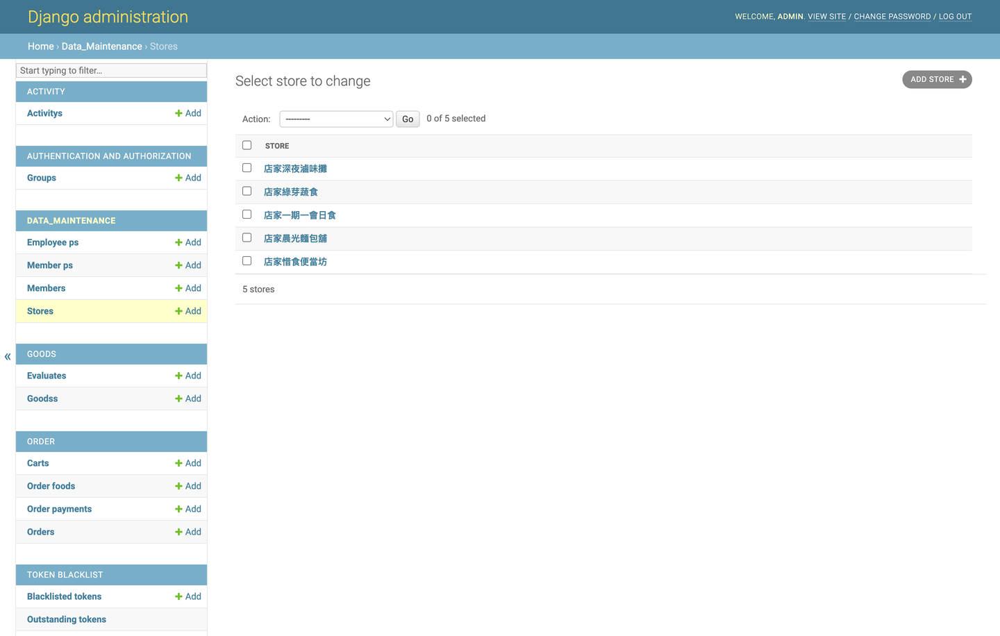
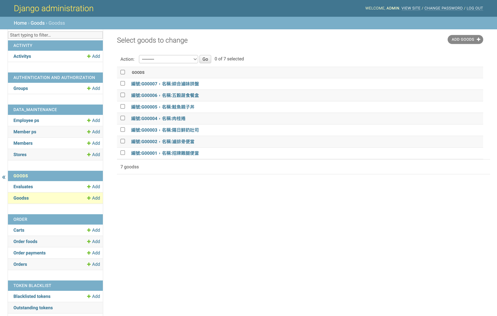
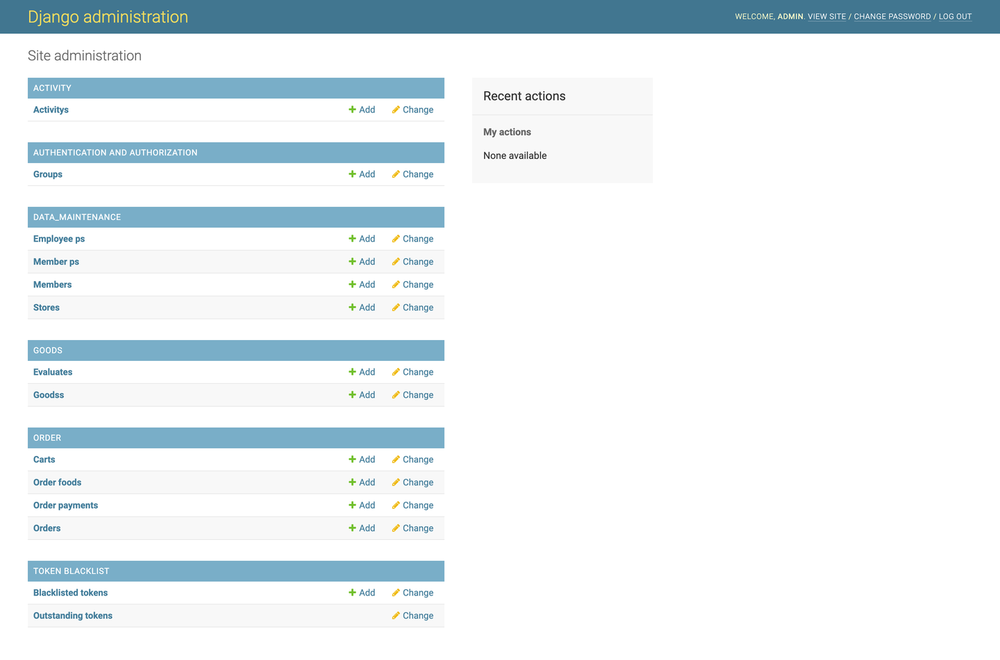
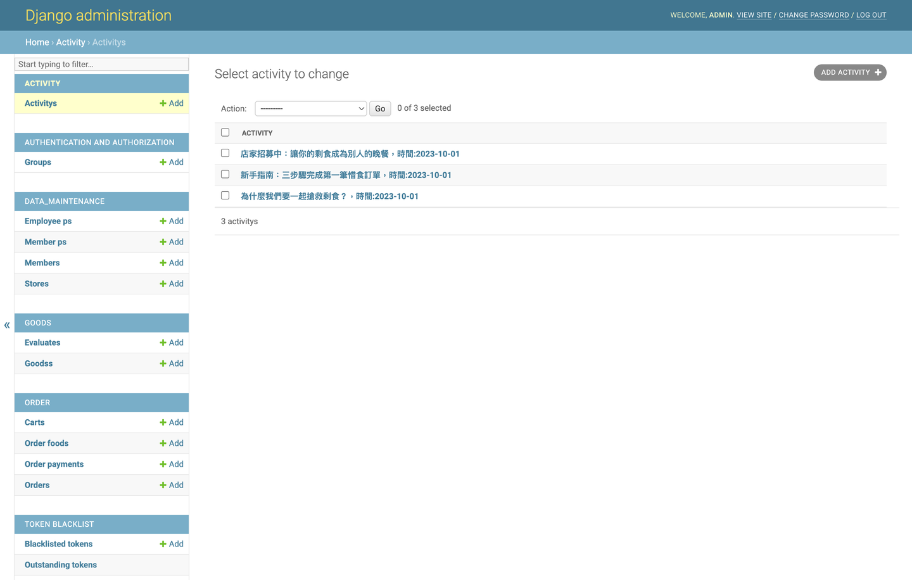
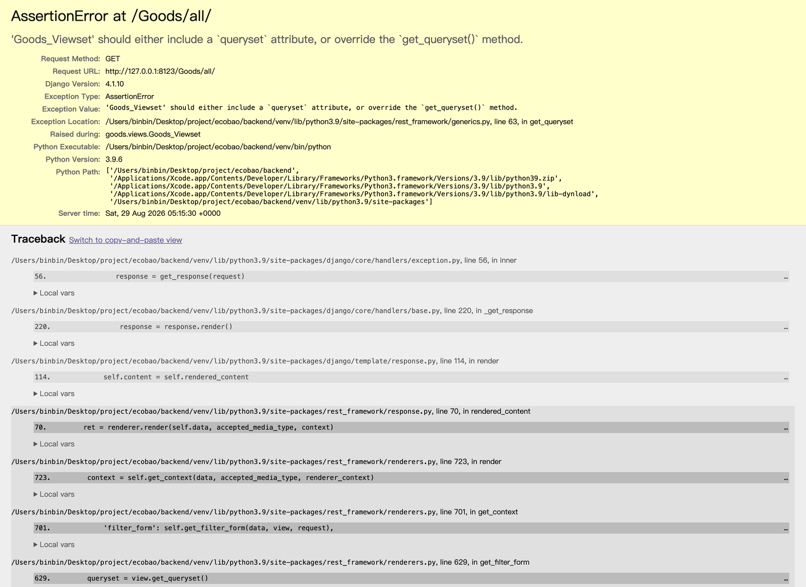
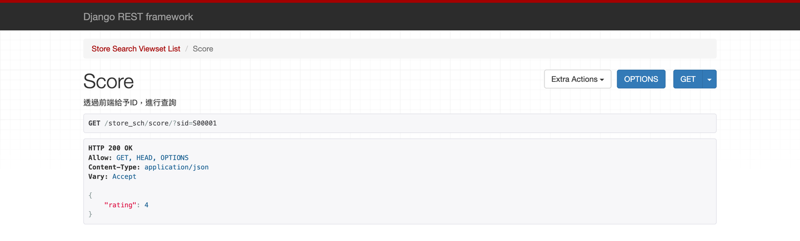

# 環飽 EcoBǎo — 剩食訂購平台 Backend

> A food-surplus (剩食) ordering platform that connects stores with surplus food to
> customers looking for affordable meals — reducing food waste while lowering the cost
> of eating. This repository is the **Django REST backend** powering both the customer
> app and the store portal.

環飽 EcoBǎo 是一個「剩食」訂購平台。餐飲店家可將當日未售完、即將報廢的餐點以優惠價上架，
消費者則能即時搜尋、下單並取餐，達成 **減少食物浪費** 與 **降低用餐成本** 的雙贏。
本專案為平台的 **後端 REST API**，同時服務「消費者端」與「店家端」。

**60 秒快速體驗**（不需要 MySQL、不需要任何金鑰）：

```bash
python -m venv venv && source venv/bin/activate
pip install -r requirements-dev.txt
python manage.py migrate   --settings=ecobao.settings_demo
python manage.py seed_demo --settings=ecobao.settings_demo
python manage.py runserver --settings=ecobao.settings_demo
```

接著打開 <http://127.0.0.1:8000/Goods/all/>，即可看到含示範資料的 API。
詳見下方 [實際畫面 Demo](#實際畫面-demo)。

---

## 實際畫面 Demo

後端本身沒有自己的網頁前端（消費者端為 React Native App、店家端為 Web 前端，各自獨立 repo），
因此這裡以 **Django Admin 後台** 與 **DRF 瀏覽介面** 呈現實際可操作的畫面。
以下截圖皆由 `scripts/screenshots.py` 對 demo 模式的真實伺服器自動擷取。

### Django Admin — 後台管理

| 店家管理 | 商品（剩食）管理 |
| --- | --- |
|  |  |

| 後台首頁 | 活動 / 最新消息 |
| --- | --- |
|  |  |

### DRF 瀏覽介面 — REST API

公開端點可直接於瀏覽器操作，不需登入：



店家評分由所有評論的星等平均後無條件捨去：



### 自己跑一次 Demo 模式

`ecobao/settings_demo.py` 以 **SQLite** 取代 MySQL，並內建固定金鑰，
因此不需要資料庫伺服器、也不需要 `.env` 就能啟動：

```bash
pip install -r requirements-dev.txt

# 建立 demo 資料庫（產生 demo.sqlite3，已列入 .gitignore）
python manage.py migrate --settings=ecobao.settings_demo

# 灌入示範店家 / 商品 / 評論 / 活動（可重複執行）
python manage.py seed_demo --settings=ecobao.settings_demo

# （選用）建立後台管理員，用來瀏覽 Django Admin
DJANGO_SUPERUSER_PASSWORD=demo1234 python manage.py createsuperuser \
    --noinput --account admin --uid M00000 --settings=ecobao.settings_demo

python manage.py runserver --settings=ecobao.settings_demo
```

啟動後可瀏覽：

| 網址 | 內容 |
| --- | --- |
| <http://127.0.0.1:8000/Goods/all/> | 所有供應中的剩食商品（DRF 瀏覽介面） |
| <http://127.0.0.1:8000/store_sch/all/> | 所有店家 |
| <http://127.0.0.1:8000/store_sch/score/?sid=S00001> | 指定店家的平均評分 |
| <http://127.0.0.1:8000/news/all/> | 活動 / 最新消息 |
| <http://127.0.0.1:8000/default/admin/> | Django Admin（帳號 `admin` / 密碼 `demo1234`） |

> Demo 產生的示範帳號為 `store01`～`store05` 與 `customer`，密碼皆為 `demo1234`。
> 所有 demo 資料皆為虛構，僅供本機展示。

---

## 功能總覽 Features

- **會員系統**：以自訂 `MemberP` 使用者模型搭配 JWT (SimpleJWT) 進行註冊、登入與權限控管。
- **店家入口 Store Portal**：店家資料維護、營業時間、商品（剩食）上架與管理。
- **商品與搜尋**：商品瀏覽、店家搜尋、鄰近店家（geopy 距離計算）、圖片上傳（Pillow 處理）。
- **訂單流程**：購物車、下單、訂單查詢、接單／完成／取消狀態流轉。
- **Email 通知**：訂單狀態變更時，以 Jinja2 HTML 模板寄送 Gmail SMTP 通知信。
- **活動／新聞**：平台活動與最新消息發布。
- **地理編碼**：透過 Google Maps Geocoding API 將店家地址轉為經緯度。

---

## 技術棧 Tech Stack

| 類別 | 技術 |
| --- | --- |
| Language | Python 3.9+（開發與 CI 實測於 3.9 / 3.11） |
| Framework | Django 4.1 |
| API | Django REST Framework |
| Auth | djangorestframework-simplejwt (JWT) |
| Database | MySQL（正式）／ SQLite（測試與 demo） |
| CORS | django-cors-headers |
| Rate limiting | django-ratelimit |
| Images | Pillow |
| Geo | geopy（距離）＋ Google Maps Geocoding API（地址轉座標） |
| Email templating | Jinja2 + Gmail SMTP |
| Config | python-dotenv (`.env`) |
| Test | Django `TestCase` / DRF `APIClient`（68 個測試） |

---

## 系統架構 Architecture

專案採 Django 多 app 架構，各司其職：

| App | 職責 Responsibility |
| --- | --- |
| `ecobao` | 專案設定（`settings.py`、`settings_test.py`、`settings_demo.py`）、根路由（`urls.py`）、WSGI/ASGI 進入點、測試共用工具（`testutils.py`）。 |
| `data_maintenance` | 核心資料網域：自訂使用者 `MemberP`、會員 `Member`、員工 `Employee`、店家 `Store` 與營業時間 `Store_open`；登入 / 註冊 / 個資 / 店家資料 API 與 JWT serializer。 |
| `goods` | 商品（剩食）`Goods` 與店家評論 `Evaluate`；商品瀏覽、店家上傳商品、評論 API。 |
| `order` | 購物車 `Cart`、訂單 `Order`、訂單品項 `OrderFood`、付款 `OrderPayment`、接單 / 取消 `Ordercheck` / `OrderCancel`；下單與訂單查詢 API。 |
| `activity` | 平台活動 / 新聞 `Activity`（含首圖等多張圖片）。 |
| `notice` | Email 通知模組（`Email` 類別 + `order.html` Jinja2 模板），供 `order` app 呼叫寄送訂單通知信。 |

請求大致流經：

```
App / Web 前端
      │  HTTPS + JWT (Authorization: Bearer …)
      ▼
ecobao/urls.py  ──►  DRF Router / ViewSet  ──►  Serializer  ──►  Model  ──►  MySQL
                                   │
                                   ├──►  notice（Jinja2 + SMTP 寄送訂單通知）
                                   └──►  Google Maps Geocoding / geopy（地理資訊）
```

> 註：`INSTALLED_APPS` 目前註冊 `activity`、`goods`、`order`、`data_maintenance`；`notice`
> 以一般 Python 模組方式被 `order.views` 匯入使用。

### 權限預設 Permissions

DRF 全域預設為 `IsAuthenticated`（見 `settings.py` 的 `REST_FRAMEWORK`）。
公開 endpoint 於各 view/action 以 `@permission_classes([AllowAny])`（必要時搭配
`authentication_classes=[]`）明確覆寫，例如商品瀏覽、店家查詢、註冊等。

### 開發用腳本 Dev scripts

| 腳本 | 用途 |
| --- | --- |
| `scripts/seed/` | 以 `pymysql` 直接對本機 MySQL 寫入大量假資料，詳見 `scripts/seed/README.md`。 |
| `scripts/screenshots.py` | 對 demo 伺服器自動擷取 README 用截圖，輸出至 `docs/screenshots/`。 |
| `manage.py seed_demo` | 建立 demo 展示資料（SQLite，跨平台，建議優先使用）。 |

---

## API 總覽 API Overview

Base URL 例：`http://localhost:8000/`

### 認證 Authentication

| Method | Endpoint | 說明 |
| --- | --- | --- |
| POST | `/api/token/obtain/` | 取得 JWT access / refresh token（body：`account`、`password`） |
| POST | `/api/token/refresh/` | 以 refresh token 換發新的 access token |
| POST | `/api/token/verify/` | 驗證 token 有效性 |
| POST | `/Member/login/` | 會員登入（回傳 JWT） |
| GET | `/Store/check/` | 驗證登入者是否具店家身分 |

token 內含自訂 claims `uid` 與 `account`（見 `Member_TokenObtainPairSerializer`）。

### 資源 Resources（DRF Router）

| Endpoint | ViewSet | 說明 |
| --- | --- | --- |
| `/member/` | `MemberAPIViews` | 會員基本資料 |
| `/memberP/` | `MemberP_Viewset` | 會員隱私 / 帳號資料 |
| `/register/` | `Member_register_APIViews` | 會員註冊 |
| `/store_data/` | `Store_data_Viewset` | 店家資料維護 |
| `/store_sch/` | `Store_search_Viewset` | 店家搜尋（類型 / 地區 / 關鍵字 / 鄰近 / 評分） |
| `/store_data/goods/` | `Goods_Upload_Viewsets` | 店家上架 / 管理商品 |
| `/Goods/` | `Goods_Viewset` | 商品瀏覽 |
| `/Evaluate/` | `Evaluate_store_Viewset` | 店家評論 |
| `/cart/` | `CartViewset` | 購物車 |
| `/order/` | `OrderViewset` | 訂單（下單、狀態流轉、通知） |
| `/orderv/` | `Order_read_Viewset` | 訂單查詢 |
| `/news/` | `Activity_Get_APIViews` | 活動 / 新聞 |
| `/default/admin/` | Django Admin | 後台管理 |

常用公開端點範例：

```bash
curl http://127.0.0.1:8000/Goods/all/                     # 所有供應中商品
curl http://127.0.0.1:8000/Goods/id/?gid=G00001           # 單一商品
curl http://127.0.0.1:8000/store_sch/search/?name=便當     # 依名稱搜尋店家
curl http://127.0.0.1:8000/store_sch/score/?sid=S00001    # 店家評分
curl http://127.0.0.1:8000/news/all/                      # 活動公告
```

> 各 ViewSet 標準支援 REST 動詞（`GET` / `POST` / `PUT` / `PATCH` / `DELETE`），
> 部分附有自訂 action（如訂單通知）。詳見各 app 的 `views.py`。

---

## 開發環境設定 Getting Started

### 前置需求 Prerequisites

- Python 3.9+
- MySQL 8.x（建立一個名為 `ecobao` 的資料庫）
  - `mysqlclient` 需先安裝 MySQL client library 才能編譯：
    - macOS：`brew install mysql-client pkg-config`
    - Debian/Ubuntu：`sudo apt-get install python3-dev default-libmysqlclient-dev build-essential`
  - 若只想跑測試或 demo，**不需要 MySQL**，改裝 `requirements-dev.txt` 即可。

### 步驟 Steps

```bash
# 1. 建立並啟用虛擬環境
python -m venv venv
source venv/bin/activate          # Windows: venv\Scripts\activate

# 2. 安裝相依套件
pip install -r requirements.txt       # 正式執行（含 MySQL 驅動）
# pip install -r requirements-dev.txt # 只跑測試 / demo（SQLite，不需 MySQL）

# 3. 設定環境變數
cp .env.example .env
#   接著編輯 .env，填入 SECRET_KEY、資料庫連線、Email、Google Maps API key 等。
#   產生 SECRET_KEY：
#   python -c "from django.core.management.utils import get_random_secret_key; print(get_random_secret_key())"

# 4. 建立資料表
python manage.py migrate

# 5. （選用）建立管理者帳號
python manage.py createsuperuser

# 6. 啟動開發伺服器
python manage.py runserver
```

伺服器預設運行於 `http://127.0.0.1:8000/`。

---

## 測試 Tests

測試使用 `ecobao/settings_test.py`，資料庫為 **SQLite in-memory**，
因此 **不需要 MySQL、不需要 `.env`、不需要任何金鑰** 即可執行：

```bash
pip install -r requirements-dev.txt
python manage.py test --settings=ecobao.settings_test
```

預期輸出：

```
Ran 68 tests in 0.5s

OK
```

只跑單一 app 或單一測試類別：

```bash
python manage.py test goods --settings=ecobao.settings_test
python manage.py test data_maintenance.tests.JWTLoginTests --settings=ecobao.settings_test
```

測試涵蓋範圍：

| 檔案 | 涵蓋內容 |
| --- | --- |
| `data_maintenance/tests.py` | 會員註冊（含必填驗證與密碼雜湊）、帳號重複、JWT 取得 / 更新 / 自訂 claims、受保護端點的匿名擋擋、店家搜尋與評分彙總、鄰近店家距離篩選、自訂 UserManager。 |
| `goods/tests.py` | 商品列表僅回傳供應中商品、單一商品查詢、依店家查詢、序列化欄位白名單、店家端上下架權限（非店家與匿名皆須擋下）。 |
| `order/tests.py` | 購物車新增 / 重複加入更新數量 / 超出庫存擋下 / 修改 / 刪除、跨帳號存取防護、購物車與訂單序列化器的小計與關聯欄位。 |
| `activity/tests.py` | 活動列表僅回傳已上架文章、單篇查詢與錯誤處理、序列化欄位。 |

`ecobao/testutils.py` 提供共用的測試資料工廠（會員、店家、商品、評論、活動、JWT client）。

---

## 環境變數 Environment Variables

所有敏感設定皆已抽離至環境變數，請參考 [`.env.example`](./.env.example)：

| 變數 | 說明 |
| --- | --- |
| `SECRET_KEY` | Django 密鑰（正式環境務必更換） |
| `DEBUG` | 除錯模式（正式環境設為 `False`） |
| `ALLOWED_HOSTS` | 允許的主機（逗號分隔） |
| `DB_ENGINE` / `DB_NAME` / `DB_USER` / `DB_PASSWORD` / `DB_HOST` / `DB_PORT` | 資料庫連線 |
| `CORS_ALLOWED_ORIGINS` | 允許跨域來源（逗號分隔） |
| `EMAIL_HOST_USER` / `EMAIL_HOST_PASSWORD` | Gmail SMTP 帳號與應用程式密碼 |
| `GOOGLE_MAPS_API_KEY` | Google Maps Geocoding API 金鑰 |

> **安全提醒**：`.env` 已列入 `.gitignore`，請勿提交任何真實金鑰至版本控制。
> `settings_test.py` 與 `settings_demo.py` 內含的金鑰為固定測試值，僅供本機使用。

---

## 專案結構 Project Layout

```
.
├── ecobao/                 # 專案設定與路由
│   ├── settings.py         #   正式設定（讀取 .env）
│   ├── settings_test.py    #   測試設定（SQLite in-memory）
│   ├── settings_demo.py    #   Demo 設定（SQLite 檔案）
│   ├── testutils.py        #   測試資料工廠
│   └── urls.py
├── data_maintenance/       # 會員 / 店家網域（含 seed_demo 指令）
├── goods/                  # 商品（剩食）與評論
├── order/                  # 購物車與訂單
├── activity/               # 活動 / 最新消息
├── notice/                 # Email 通知模組
├── scripts/
│   ├── seed/               #   MySQL 假資料腳本
│   └── screenshots.py      #   README 截圖產生器
├── docs/screenshots/       # README 使用的截圖
├── requirements-base.txt   # 核心套件（不含 DB 驅動）
├── requirements.txt        # 正式執行（+ MySQL 驅動）
└── requirements-dev.txt    # 測試 / demo（不需 MySQL）
```

---

## 授權 License

本專案作為個人作品集（portfolio）用途展示，未附帶授權條款（無 `LICENSE` 檔案）；
如需引用或再利用，請先與作者聯繫。
